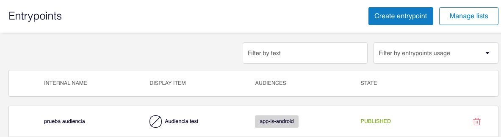
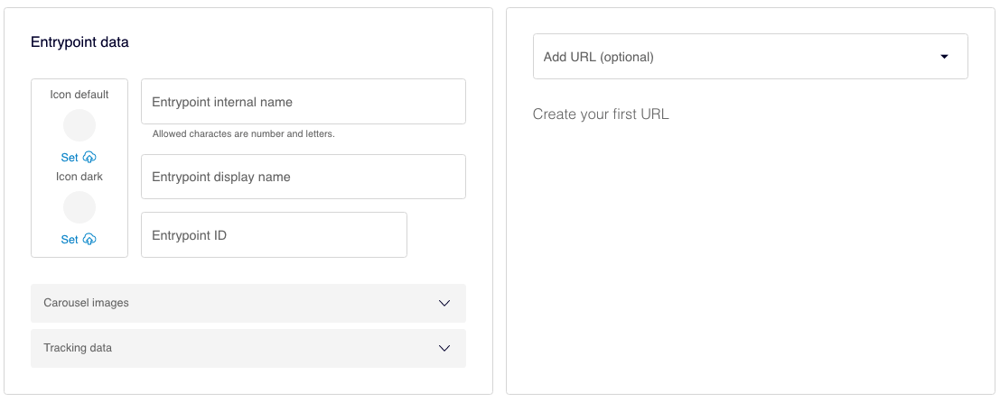
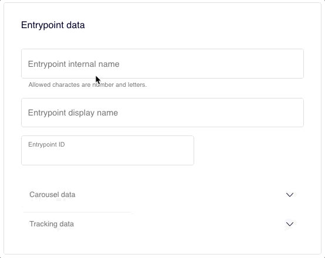
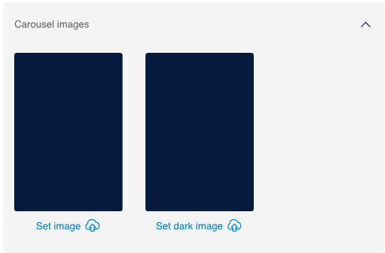
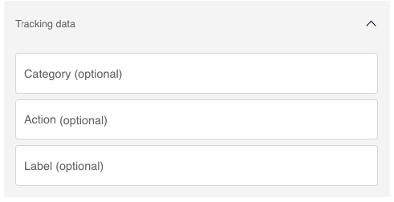
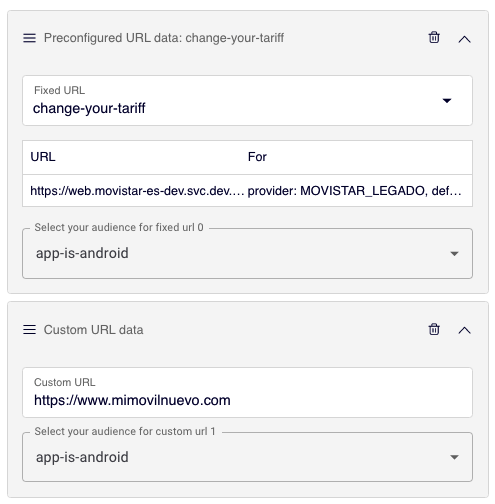
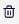

# Como criar um entrypoint

## Antes de criar um novo entrypoint

É importante que você tenha em mente que um entrypoint tem entidade própria, isto é, várias listas de entrypoints podem conter esse entrypoint. A lógica por trás deste CMS permite mostrar ou não o entrypoint em função da lista a que pertence e dos públicos para os quais foi configurado.

### O que isto quer dizer exatamente?

Um usuário nunca verá um entrypoint que não lhe corresponda, sempre que esse entrypoint esteja corretamente configurado.

 Por exemplo:

*Alice é usuária de um dispositivo Android. Alice nunca verá um entrypoint configurado para ser visto apenas por usuários de iOS.* 

## Criar um entrypoint

Antes de criar ou editar um entrypoint, verifique se está na [seção de criação de entrypoints](./#estoy-en-la-seccion-para-crear-o-editar-un-entrypoint).

Clique no botão **Create entrypoint**.

Para cada entrypoint, preencha os seguintes campos:

**Icon default.** Ícone vinculado ao entrypoint, que é exibido quando os entrypoints são apresentados em modo lista. Clique em **Set** :outbox_tray: para adicionar um ícone.  :low_brightness: É obrigatório.

**Icon dark**. Versão para *dark mode* do ícone vinculado ao entrypoint. Clique em Clique em **Set** :outbox_tray: para adicionar um ícone.  :low_brightness: É opcional. Se você não incluir, então a versão default também será utilizada em *dark mode*.

 Note que este campo de ícones só é exibido se requerido pela OB.

- Se este campo não é visto no CMS, quer dizer que em nenhum caso os entrypoints vão acompanhados por ícones.
- Se pelo contrário, este campo estiver visível no CMS, então é obrigatório adicionar pelo menos o **Icon default**. 

**Entrypoint internal name**. Insira um nome que descreva o entrypoint que você está criando, para que seja mais fácil sua posterior localização. Este nome não é exibido aos usuários.  :low_brightness: O nome pode conter letras tanto maiúsculas quanto minúsculas, números e espaços, mas não admite outros caracteres, como travessões baixos, acentos ou outros caracteres especiais.

 :nerd: Ao indicar o nome interno, pense de maneira natural como designar para que qualquer pessoa entenda o que representa esse entrypoint.

*Por exemplo:*

 **:thumbsup:* Programar encontro na loja*  **:thumbsdown:* ProgramarEncontroLojaV1* 

**Entrypoint display name**. Nome do entrypoint visto no app. Este nome **sim** é visto pelo usuário.

**Entrypoint ID**. É construído de maneira automática com base no Entrypoint internal name, mas você pode fazer alterações em caso necessário.

#### **Carousel images**

Abra esta seção para adicionar as imagens do entrypoint que está criando. São as imagens exibidas quando a lista é configurada para ser exibida no modo carrusel.  :low_brightness: Estas imagens não são obrigatórias e apenas são exibidas se na lista você está configurando o modo de vista Carrusel. Se não incluir imagens, então uma imagem com a cor base da OB será exibida.

Você tem a opção de incluir duas imagens:

- Clique em <strong>Set image</strong>: outbox_tray: para adicionar a imagem que será exibida no carrusel de maneira predeterminada.
- Clique em <strong>Set dark imagen</strong> :outbox_tray: para adicionar a imagem que será exibida no carrousel no modo noite ou *dark mode*.  :low_brightness: Se você não a incluir, então, a imagem incluída para o modo predeterminado será exibida.

 :nerd: Observe que a imagem requerida é a **Set imagen**, à esquerda. Se você incluir só a Dark image, então também solicitará a inclusão da Imagen Default. 

#### **Tracking data**

Informações relacionadas com o tracking do entrypoint. Com o total destes campos é composta a URL de tracking do entry point.  :low_brightness: Todos os campos são opcionais

**Category (optional)**. Categoria do entrypoint.

**Action (optional)**. Ação associada ao entrypoint.

**Label (optional)**. Etiqueta que identifica o entrypoint.

### Create your first URL

Configure esta seção para indicar a que URL direciona o entrypoint quando o usuário clica.

**Add URL**. Selecione uma das opções:

- **Preconfigured**. Selecione esta opção para escolher uma URL fixa, previamente configurada. Clique em Preconfigured URL data para selecionar uma URL das disponíveis. Uma vez feito isso, pode consultar (mas não editar) o **URL** e o provider, que é exibido no campo **For**.
- **Custom**. Selecione esta opção para adicionar uma URL à mão.

Clique outra vez no menu suspenso Add URL (opcional) e selecione  para adicionar URLs em função dos públicos.

#### Ordem das URLs

Se adicionar mais de uma URL, considere que a ordem de exibição é importante. É possível que os públicos sejam exclusivos, isto é, que cada entrypoint vá a uma audiência que não compartilha usuários a quem se aplicaria. Nesse caso, a ordem não é importante.

Mas o que acontece se as URLs direcionam públicos não exclusivos? Isto é, há usuários que podem preencher as características de mais de um público ao mesmo tempo. Neste caso, a ordem é importante.

O sistema lê de cima para baixo, isto é, mostrará ao usuário a URL que primeiro encontrar fazendo uma busca de cima.

Uma vez configuradas todas as URLs, elas podem ser ordenadas por meio de *drag&amp;drop*.

 Por exemplo:

🥇Você configurou uma URL para o público `os-fãs-do-esporte`. Esta URL leva a uma promoção sobre novos canais de esporte.

🏀Configure uma segunda URL para o público `os-fãs-do-basquete`. Neste caso, a URL leva a uma promoção com uma série de documentários sobre a NBA.

*Alice é uma usuária que adora esportes e, pela configuração dos públicos, esta usuária está integrada dentro do público `os-fãs-do-esporte` e também no público `os-fãs-do-basquete.`*

Que promoção a Alice verá? Depende da ordem en que você colocar as URLs:

Ela verá a promoção dos canais de esporte se você colocar as URLs da seguinte maneira:

1. `os-fãs-do-esporte`
2. `os-fãs-do-basquete`

Ela verá a promoção sobre os documentários da NBA se você colocar as URLs da seguinte maneira:

1. `os-fãs-do-basquete`
2. `os-fãs-do-esporte`



Você tem uma URL configurada para o público `os-fãs-do-esporte`

Você tem outra URL configurada para o público `os-fãs-do-basquete`

Alice é uma usuária que adora esportes e, pela configuração dos públicos, esta usuária está integrada dentro do público `os-fãs-do-esporte` e também no público `os-fãs-do-basquete.`

Uma URL foi configurada sobre uma jogo de basquete muito importante e outra URL sobre novos canais de esporte.

#### Como apagar uma URL

Clique em  para eliminar uma URL configurada.

Clique no botão **Save and publish** para publicar as alterações.

Clique no botão **Save draft** para salvar as mudanças sem publicá-las. Poderá publicá-las posteriormente, se for necessário.

## Editar um entrypoint

Clique na linha do entrypoint que deseja editar. A janela de criação/edição do entrypoint é aberta. Faça as mudanças necessárias.

 Observe que há dois campos que não podem ser editados: **Internal name** e **ID** 

Ao realizar mudanças você poderá:

- Salvar os campos, mas não publicá-los: clique em <strong>Save and unpublish</strong>.
- Salvar as mudanças e publicá-las: clique em **Save and publish**.
- Iniciar um teste: clique em **Save and test**.
