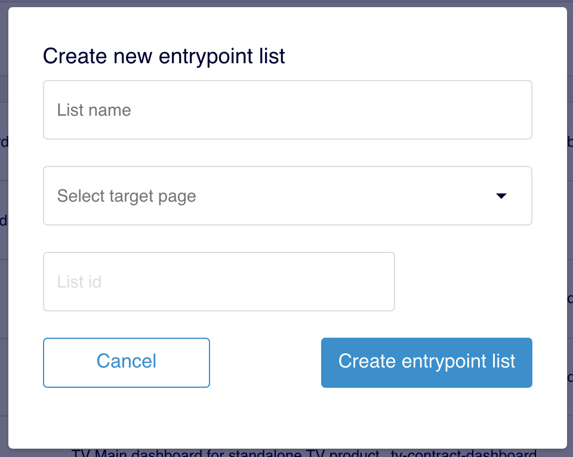

# Cómo crear una lista de entrypoints

## Crear lista

Haz clic en el botón **Create list:**

Rellena los campos:

**List name**. Nombre de la lista que estás creando. Este nombre es utilizado para crear el ID de manera automática y por eso solo admite números y letras, no caracteres especiales.


Puedes cambiar el valor de este **List name** en cualquier momento (no así el del **List id**).


**Select target page**. Selecciona la página destino en la que se mostrará la lista.

Se muestran todas las target page disponibles (no solo las de la Home)

**List id**. Este campo se autorrellena en base al valor que indiques en el campo _List name_.\
Puedes editarlo pero no es recomendable.


El **List id** solo puedes editarlo en el momento en el que estás creando el entry point pero no cuando ya esté creado. Asegúrate por tanto de que el **List id** responde a tus necesidades.


Haz clic en **Create entrypoint list** para guardar la lista y comenzar los pasos de configuración de esa lista.
