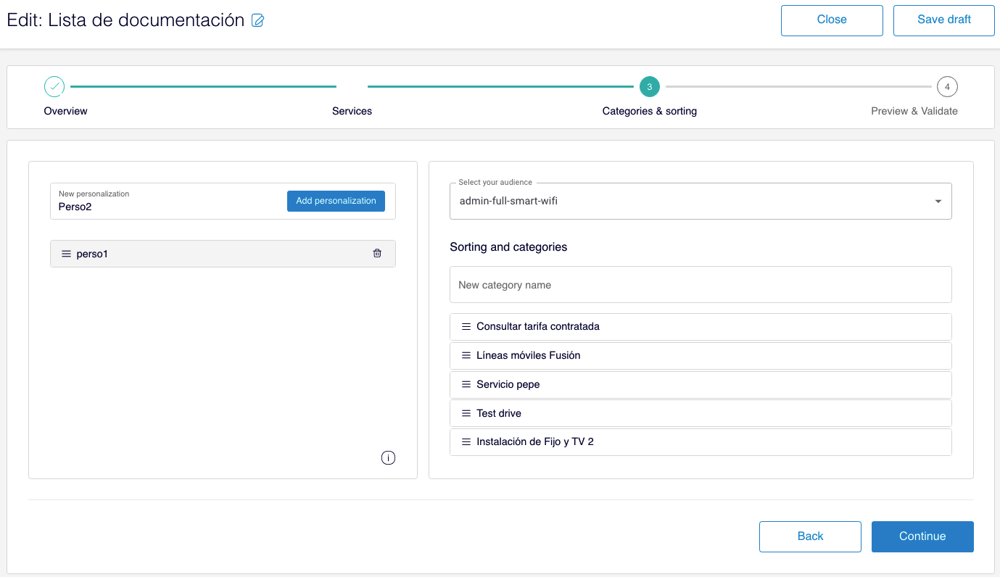

# <a>Categorias e ordem</a>

Este **passo é opcional** e, portanto, só é necessário se a lista que você está criando exigir algumas das seguintes características:

- **Ordenar** de forma diferente os entry points **em função dos públicos**, isto é, ordenar segundo os diferentes tipos de usuário.
- **Agrupar** os entry points **em Categorias**, isto é, se a lista de entry points deve aparecer dividida em categorias na página de vista completa (que aparece quando o usuário clica em **"Outros serviços"**)

Para criar categorias ou ordens diferentes, clique em **Add categories and custom sorting**.

Se a lista que você está criando não requer nada do acima mencionado, pule este passo e clique em **Continue**.

## Nova personalização

 **IMPORTANTE**: Se você criar múltiplas personalizações, então a primeira personalização que corresponder ao público será selecionada, de acordo com a ordem na qual você criou as personalizações (de cima para baixo). Se não houver uma personalização correspondente, então:

- Será utilizada a ordem predeterminada indicada no passo 2 (**Services**)
- Uma lista simples, sem categorias, é gerada 

Siga estes passos para configurar cada personalização:

1. Insira um nome para sua personalização no campo **New personalization **e clique em** Add personalization**.
2. Selecione o público para essa personalização no menu suspenso **Select your audience**.
3. Ordene os entry points para esse público

Uma vez criadas as personalizações necessárias, você pode simplesmente classificá-las com *Drag&amp;drop*. Lembre-se de que o usuário verá a primeira personalização que você aplicará, de acordo com o público.

Para editar quaisquer das personalizações, selecione-a clicando no nome e altere o público, as categorias e/ou a ordem dos entry points.

Para eliminar uma personalização, clique no ícone  no nome da personalização.

### Ordem e categorias

A fim de dividir uma lista em categorias, você precisa criar pelo menos uma personalização. Se você quiser que a lista seja categorizada sem levar em conta o público, basta criar a personalização, ignorando o menu suspenso Audiences. Em caso contrário, indique o público no menu suspenso **Select your audience**.

#### Sorting and categories

Adicione o nome da primeira categoria no campo **New category name** e clique em **Add category**. Repita este passo tantas vezes quantas categorias sejam necessárias.

Como você pode ver, as categorias são criadas uma embaixo da próxima. Para classificar os entry points basta arrastá-los, um a um, na ordem que você considerar, sob a categoria correspondente:

Para apagar uma categoria, clique em  no nome da categoria.

Clique em **Continue** para continuar a configuração e passar ao próximo passo.

 **IMPORTANTE**: Observe durante todo o processo de criação que clicar no botão **Continuar** não salva as mudanças.

Se você precisa salvar as mudanças neste passo, clique em **Save draft** (na parte superior direita). 
