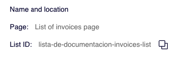
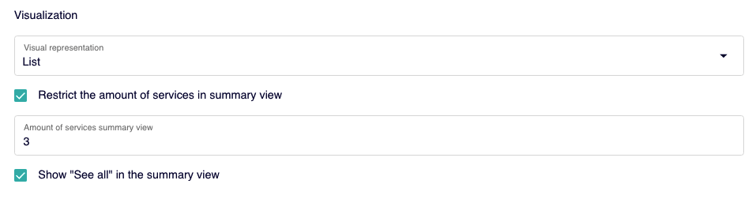
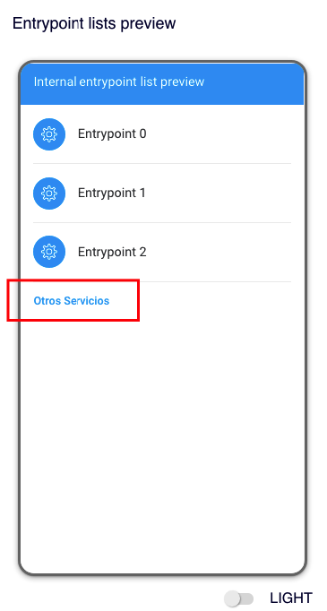

# Overview

Neste primeiro passo, você encontra, no primeiro nível, informações sobre o ID da lista que está criando e a página em que será exibida.

Se precisar do ID da lista, clique em  para copiar na área de transferência.

### Titles

#### List summary title

Este é um campo opcional e representa o título da lista.

#### Full list title

Este é um campo opcional e é o título da página que contém a lista completa. Esta página com a lista completa é exibida se o usuário tiver ativado a verificação **Restrict the amount of services in summary view** e se também marcou a verificação **Show "See all"** in the summary view.

 Esta página é uma nova página que o usuário acessa clicando no link "Outros serviços". 

### Visualization

Esta seção indica o modo em que serão visualizados os entry points da lista:

- **List**. Para exibir os elementos em modo lista.
- **Carousel**. Para exibir os elementos em modo carrusel.

 As listas terão ícones dependendo da OB, isto é, alguns OBs têm configurado que as listas suportam ícones e outros OBs têm configurado que não podem ser adicionados.

Você saberá isto quando [configurar os entry points](../como-crear-editar-un-entrypoint.md#crear-un-entrypoint), porque se aceitam ícones, então terá a opção de adicioná-los. 

**Restrict the amount of services in summary view**. Selecione esta verificação para restringir o número de ícones que são exibidos na lista.

**Amount of services summary view**. Se você selecionou a verificação **Restrict the amount of services in summary view** então indique o número máximo de entry points que serão exibidos.

**Show "See all" in the summary view**. Marque esta verificação para exibir o link que permite visualizar a página com toda a lista de entry points completa.

 :wink: Recomenda-se que, se você restringir o número de elemtnos a serem exibidos na lista, então também exiba o link para que a lista completa possa ser vista. 

### Entrypoint lists preview

Nesta seção, você pode ver como será a lista quando for publicada.

Use o controle **LIGHT/DARK** para simular a visualização em *dark mode* ou em *light mode*.

 Tenha em mente que esta é apenas uma vista prévia que pretende dar uma ideia de como o conteúdo será exibido. Observe que, nesta fase, não há informações reais sobre quais entry points você incluirá ou quaisquer outros dados.

No último passo, destinado precisamente à visualização e ao resumo da configuração da lista, você já pode ter uma imagem mais precisa de como o conteúdo será exibido. Mesmo assim, é melhor fazer um [test](../como-hacer-un-test.md) antes de publicar o conteúdo para ter certeza de que tudo está como você precisa. 

Clique em **Continue** para continuar a configuração e passar ao próximo passo.

 **IMPORTANTE**: Observe durante todo o processo de criação que clicar no botão **Continuar** não salva as mudanças.

Se você precisa salvar as mudanças neste passo, clique em **Save draft** (na parte superior direita). 
