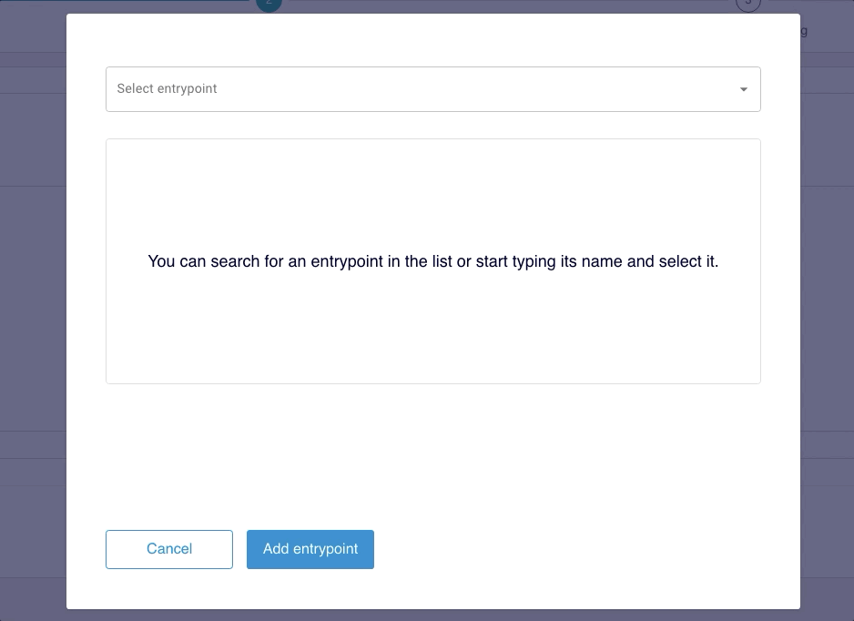
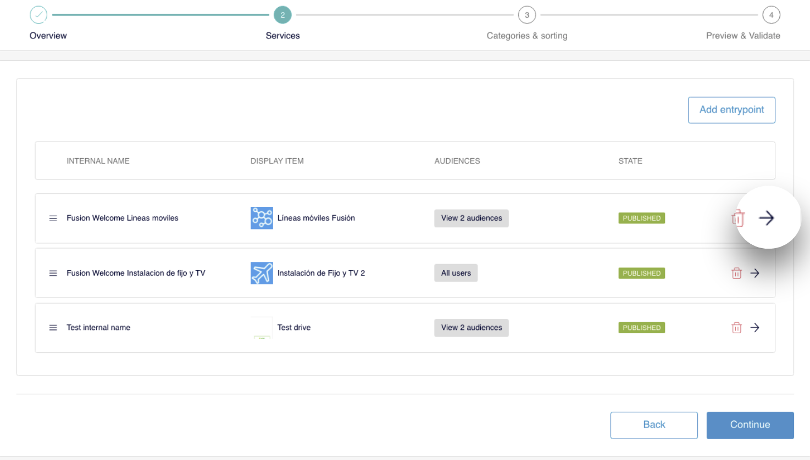
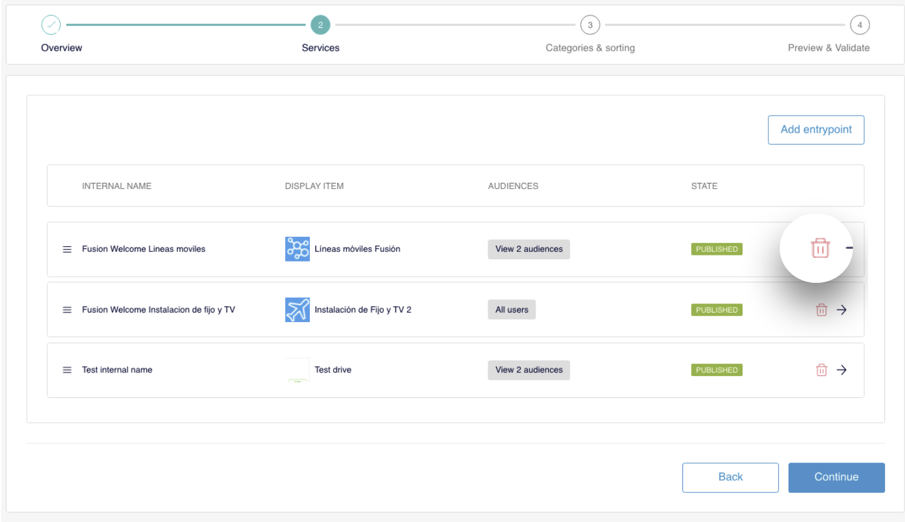
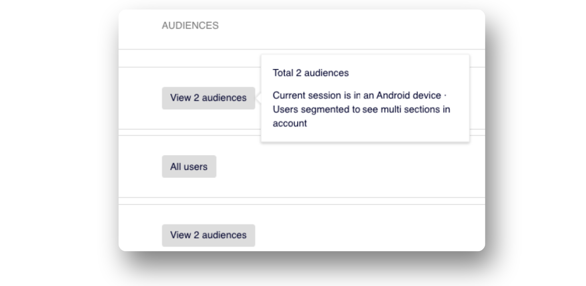

# Serviços

Neste passo Services, clique em **Add entrypoint** para adicionar, um a um, os entrypoints que conformam a lista.

No modal, selecione o entrypoint que deseja adicionar. Você pode pesquisar diretamente no menu suspenso ou começar a digitar o nome e selecioná-lo:

Você poderá ver as informações do entry point antes de confirmar: seu nome interno, o texto exibido para o usuário e o(s) público(s) para o(s) qual(is) está configurado. Clique em **Add entrypoint** para adicioná-lo à lista.

### Como mudar a ordem dos entry points na lista

A ordem na qual os pontos de entrada são exibidos nesta etapa é a mesma ordem na qual eles serão exibidos ao usuário. Se você precisa alterar a ordem, utilize a função <em>Drag&amp;drop</em>: simplesmente arraste e solte para a posição desejada.

### Como editar um entry point

Clique no ícone  na linha do entry point. Uma nova aba se abre em seu navegador. Faça as mudanças necessárias e, quando retornar à lista, atualize a aba para ver essas mudanças.

### Como eliminar um entry point da lista

Clique no ícone  na linha do entry point. Confirme a eliminação clicando em **Remove** na mensagem exibida.

### Como obter informação sobre os públicos de um entry point

Na coluna **AUDIENCES**, você pode ver a informação relativa aos públicos de um entry point aproximando o mouse e clicando no número de públicos do entry point.

Clique em **Continue** para continuar a configuração e passar ao próximo passo.

 **IMPORTANTE**: Observe durante todo o processo de criação que clicar no botão **Continuar** não salva as mudanças.

Se você precisa salvar as mudanças neste passo, clique em **Save draft** (na parte superior direita). 
