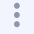
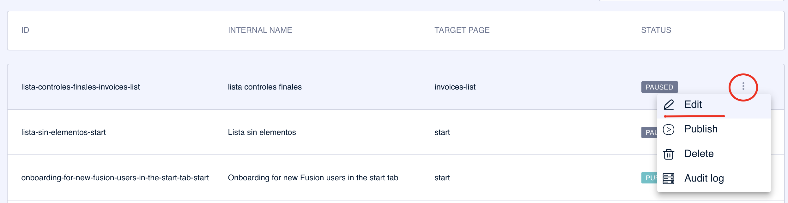
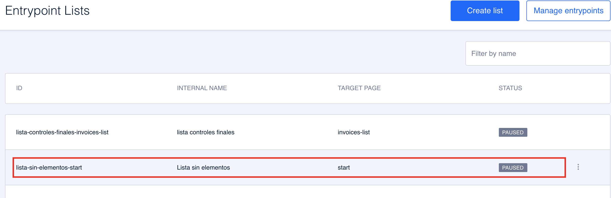

# Como editar um entrypoint ou uma lista

Para editar um entrypoint ou uma lista de entrypoint, há duas opções:

1. **Use o submenu do elemento**. Aproxime o mouse ao final da linha do elemento, clique em  e selecione a opção **Editar**.

2. **Clique na linha do elemento**. Também pode clicar em qualquer ponto do elemento que queira editar na visão geral. Note que essa linha muda de cor ao passar o mouse e que o cursor também muda, para que você saiba que essa área pode ser clicada.

Uma vez dentro do elemento, haverá certos campos que não podem ser editados, mas o conteúdo restante e a configuração podem ser modificados. Pode salvar e publicar as mudanças ou salvá-las e iniciar um [teste](como-hacer-un-test.md).
