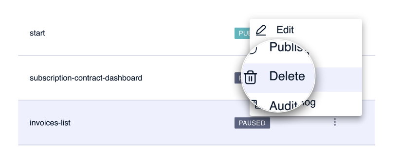
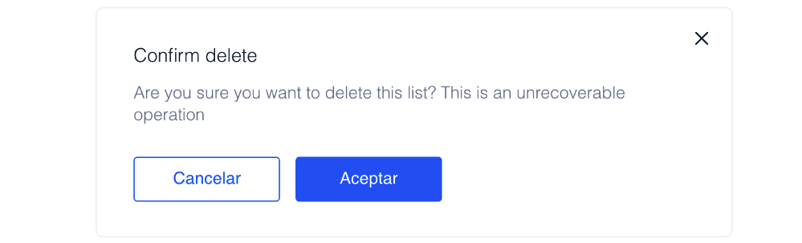

# Como eliminar uma lista de entrypoints

 Antes de eliminar uma lista, certifique-se de que você realmente deseja apagá-la, pois esta ação não pode ser defeita. Em caso de dúvidas em relação com eliminar ou não uma lista, lembre-se de que você sempre pode pausá-la para que não seja visível. 

Para eliminar uma lista de entrypoints, acesse a tela principal e aproxime o mouse do final da linha na lista. Clique em  e selecione a opção **Delete**.

Clique em **Aceitar** para confirmar a eliminação do elemento.

 Não é possível eliminar uma lista em estado PUBLISHED. Para eliminá-la, primeiro pause a lista, também no **menu secundário &gt; Paused**, e depois elimine-a conforme descrito neste capítulo. 
