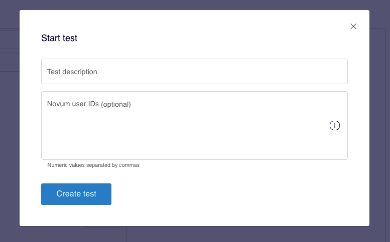
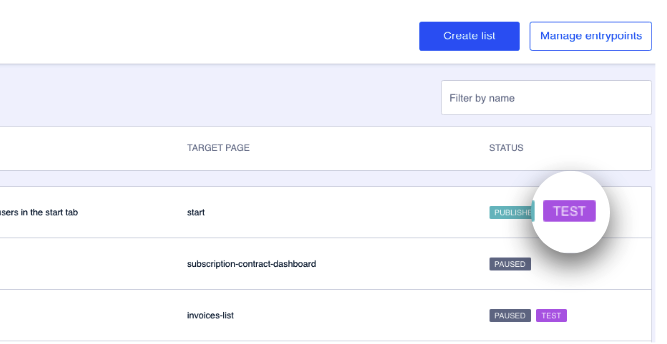
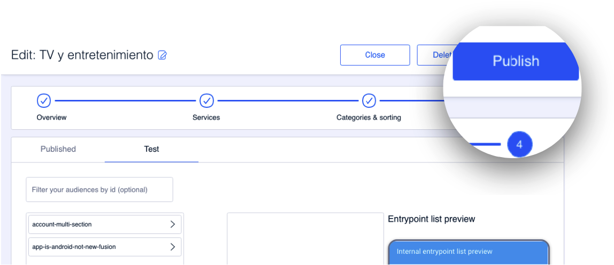
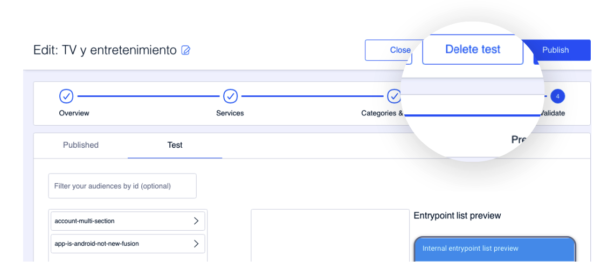
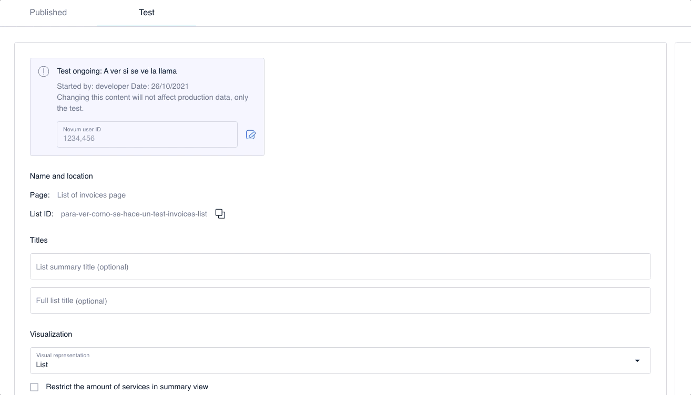

# Como fazer um teste

É ideal usar a funcionalidade de teste oferecida pela ferramenta para visualizar o conteúdo antes de ter impacto numa ampla massa de usuários.

## Como testar um conteúdo antes de sua publicação

O CMS é dividido em duas partes, a configuração de listas de entrypoints e a configuração dos próprios entrypoints.

A maneira de testar o conteúdo é quase igual em ambos os casos: sempre que aconteçam mudanças ou no final do processo de criação de um novo elemento, a opção de Teste é habilitada no CMS.

### Configurar um teste

A opção para criar um teste é exibida quando acontecem mudanças, isto é, quando há algo para ser testado. Também é possível realizar um teste de um conteúdo que acaba de ser criado e cujo resultado você precisa visualizar antes de impactar numa massa de usuários x.

#### Teste em listas de entrypoints

- Se a lista estiver em modo de rascunho, a opção de teste é exibida ao salvar as mudanças, mas sem publicá-las. Clique em **Teste** para criar um teste nessa lista.

 Observe que se você criar um teste quando a lista estiver no modo **DRAFT**, então a lista passará automaticamente para o estado **PAUSED**. 

- Se a lista estiver publicada ou pausada, é exibida a opção de teste ao realizar mudanças nessa lista. Nesse caso, clique em **Save and start test** para salvar essas mudanças e iniciar um teste.

Em ambos os casos, indique:

**Test description**: adicione uma descrição que ajude na identificação que está testando, quais são as mudanças.

**Novum user IDs (optional)**: adicione um ou mais user IDs, separados apenas com vírgulas (sem espaços) nos quais você deseja fazer os testes. É um campo opcional.

Clique em **Create test**.

 **Como obter o user ID**

1. Certifique-se de ter baixado a versão Enterprise do aplicativo.
2. Abra o app
3. Agite o telefone
4. Acesse a seção "Autentication"
5. O número que você preciso é do campo **User ID** 

#### Teste em um entrypoint

Ao contrário do caso de listas, não é possível testar um entrypoint que esteja em modo de rascunho.

No caso de entrypoints em estado publicado, faça as modificações que precisa testar e clique na opção **Save and start test**. Indique:

**Test description**: adicione uma descrição que ajude na identificação que está testando, quais são as mudanças.

**Novum user IDs (optional)**: adicione um ou mais user IDs, separados apenas com vírgulas (sem espaços) nos quais você deseja fazer os testes. É um campo opcional.

Clique em **Create test**.

### Como publicar o conteúdo de um teste

Para começar, você saberá que uma lista de entrypoints tem um teste em andamento devido à etiqueta de estado **TEST**:

Para publicar o conteúdo de um teste, acesse a lista de entrypoints em que esse teste está sendo realizado.

Uma vez aberta a lista, o conteúdo aparece dividido em duas abas para podar visualizar, a qualquer momento, o conteúdo prévio ao teste e o próprio conteúdo do teste.

 

 Você só pode fazer mudanças no conteúdo se estiver na aba **Test**. Use a outra aba para visualizar o conteúdo antes das mudanças que você fez no teste. 

Quando você tiver certeza de que o conteúdo que você tem na aba **Test**, em todas as etapas, é o conteúdo que você deseja aplicar, então clique em **Publish**. Clique **Yes** na mensagem de confirmação.

Clique em **Close** para retornar à tela principal das listas de entrypoints, **Entrypoint Lists**.

 :thumbsup:Na tela principal, você pode ver que na lista de estado a etiqueta desapareceu. **TEST**. 

### Como descartar um teste

Se após testar o conteúdo de uma lista de entrypoints com um teste em andamento você decidir descartar as mudanças, então acesse a lista de entrypoints na qual o teste está sendo executado.

Clique em **Continue** até chegar ao último passo **Preview &amp; Validate** e clique em **Delete test**.

Descartar um teste significa apagar as alterações feitas na lista de entrypoints e o conteúdo é criado como estava previamente.

### Como adicionar, remover ou modificar os Novum user IDs de um teste

Se você precisa editar o teste para adicionar, remover ou modificar os usuários que podem visualizar determinado teste, então acesse essa lista.

Na aba **Test**, você pode consultar, no primeiro passo **Overview**, as informações relacionadas ao teste: descrição, quem o iniciou e data de criação.

Clique em  para modificar os números de usuário. Também para adicionar novos user ID ou eliminar o já existente. Clique em **Save** para salvar as mudanças.

