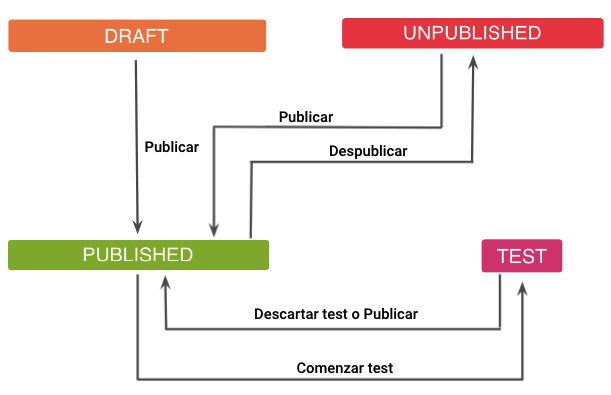
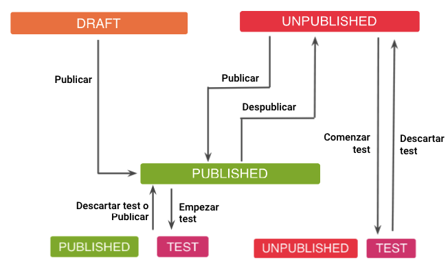

# Estados

É importante que você conheça os estados em que podem ser encontrados as listas e os entrypoints.

### Entrypoints

**DRAFT**. Estado em que um entrypoint está quando você o cria pela primeira vez e salva suas mudanças antes da publicação.

**PUBLISHED**. Etado publicado. O usuário verá o entrypoint sempre que seja configurado para um público que corresponda ao usuário e dentro de uma lista que também esteja publicada.

 Lembre-se que um entrypoint pode estar em listas diferentes e, para que possa ser visualizado, ele deve ser publicado. Mas o fato de o entrypoint estar no estado **PUBLISHED** não significa que será visualizado. Isso depende do estado da(s) lista(s) que o contém e do público configurado nessas listas. 

**PAUSED**. Estado não publicado. O entrypoint foi publicado em algum momento, mas não é mais publicado, não é visível para nenhum usuário.

**TEST**. O entrypoint possui um teste em andamento.

:nerd: Para obter mais informações sobre o comportamento de um teste em um entrypoint, consulte a seção [Teste sobre um entrypoint](como-hacer-un-test.md#test-sobre-un-entrypoint).

Aqui está um breve esquema de como fazer a transição de um estado para outro.

### Listas

**DRAFT**. Estado em que está uma lista quando você a cria pela primeira vez e salva suas mudanças antes da publicação.

**PUBLISHED**. Estado publicado. O usuário verá a lista e, portanto, os entrypoints que correspondam de acordo com os públicos configurados.

**PAUSED**. Estado não publicado. A lista foi em algum momento publicada, mas não agora. Não é visível para nenhum usuário.

**TEST**. A lista pode ter um teste em andamento. Este estado é sempre combinado com:

- **PAUSED + TEST**. Neste caso, a lista está em teste e, enquanto o teste estiver em execução, não é visto pelos usuários, apenas por aqueles configurados para o Teste.
- **PUBLISHED + TEST**. Neste caso, a lista está em teste, mas permanece publicada para o resto dos usuários. Os usuários do teste verão a versão de teste da lista e os demais usuários verão a lista como ela era originalmente, na versão publicada.

Aqui está um breve esquema de como fazer a transição de um estado para outro.

