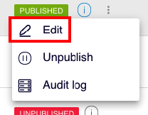

# FAQ

### Quero modificar um copy de um entrypoint. Como faço isso?

Basta editar e salvar as mudanças.

Na lista de entry points, clique na linha do entry point que você deseja editar, clique no ícone  e clique na opção **Editar**.

### Modifiquei um entry point que aparece em várias listas. Será que a mudança será vista em todas elas?

Sim, a mudança será visualizada em todas as listas que contenham esse entry point, desde que esse item esteja em uma lista visível para o usuário.

### Estou criando uma lista e, embora eu preencha o campo "**Full list title"**, não vejo isso na visualização do passo 2 "**Services". O que acontece?**

Isto porque a pré-visualização do passo 2 exibe a lista tal como o usuário a verá dentro de uma página. Este título representa o nome da página que o usuário vê, por exemplo, quando essa lista tem a opção ativada **Show "See all" in the summary view** e o usuário clica nesse "Outros serviços".

Observe este simples exemplo que o ajudará:

### Posso ver como os usuários verão o conteúdo antes da publicação?

É claro que você pode. Na verdade, é uma prática muito boa. Para fazer isso, é preciso criar um teste. Veja todas as informações ao respeito na seção:

 [como-fazer-um-teste.md](como-hacer-un-test.md) 
